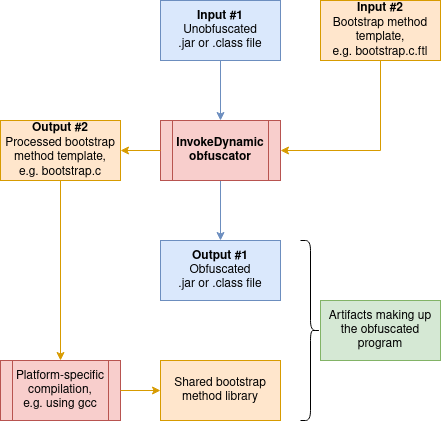

# InDy Obfuscator

InDy Obfuscator, short for InvokeDynamic Obfuscator, is an open-source obfuscator for JVM bytecode utilizing a novel
obfuscation technique which attempts to hide a program's call graph.

It does so by replacing `invoke(virtual|special|static|interface)` instructions with `invokedynamic` ones, delegating
to a bootstrap method at first invocation time. The bootstrap method is then responsible for determining the actual
call site.

By implementing the bootstrap method in native code rather than in Java itself, the level of obfuscation is increased
without sacrificing much performance. It also gives access to a broad variety of additional obfuscation methods for
native code.

## Usage

### Obtaining the obfuscator

This project uses [Apache Maven](https://maven.apache.org/) as its build system. To compile the obfuscator from source,
first clone the repository and navigate to its root directory.

An executable JAR file can be created at `target/indy-obfuscator-<version>.jar` by executing

```shell
mvn package
```

### Additional prerequisites

Due to the premise of the obfuscation technique, some non-Java related tools are required in addition to the obfuscator
itself. These tools are used to build a shared library that can be accessed using JNI. The following programs will be
needed:

- A C compiler (e.g. [GCC](https://gcc.gnu.org/), [Clang](https://clang.llvm.org/),
  or [MSVC](https://visualstudio.microsoft.com/vs/features/cplusplus/)), for the compilation of the bootstrap method
  source code generated from the bootstrap method template processing

- (optional, recommended) CMake, to compile the bootstrap method source code without manually locating `jni.h`

### Obfuscation process

Once all prerequisites have been met you can get started with the actual obfuscation process. Two input files are
required for this:

1. a JAR file to be obfuscated

2. a bootstrap method template

   An example bootstrap method template can be found at [native/bootstrap.c.ftl](native/bootstrap.c.ftl).

See the diagram below for a high-level overview of the obfuscation process.

<p align="center">
    
</p>

## Project structure

The below project layout gives an overview over the most important files and folders within this repository.

```text
 ├─ native/
 │   ├─ cmake/            CMake build directory
 │   ├─ bootstrap.c.ftl   Sample bootstrap method template for C
 │   └─ debug.h           Utility functions for debugging JNI code
 └─ src/
     ├─ main/java/dev/blanke/indyobfuscator/
     │   ├─ mapping/
     │   ├─ template/
     │   ├─ visitor/
     │   │   ├─ bootstrap/
     │   │   ├─ field/
     │   │   └─ obfuscation/
     │   └─ InDyObfuscator.java
     └─ test/java/dev/blanke/indyobfuscator/
         ├─ util/
         └─ InDyObfuscatorTest.java
```

## Related projects

- [superblaubeere27/obfuscator](https://github.com/superblaubeere27/obfuscator), an open-source Java bytecode obfuscator
  supporting a variety of obfuscation techniques, including regular `invokedynamic` obfuscation.
- [Zelix KlassMaster](https://www.zelix.com/klassmaster/index.html), a commercial obfuscator for Java bytecode.

## Links

- [ASM 4.0 - A Java bytecode engineering library](https://asm.ow2.io/asm4-guide.pdf)
- [Java Native Interface Specification: Contents](https://docs.oracle.com/en/java/javase/18/docs/specs/jni/)
