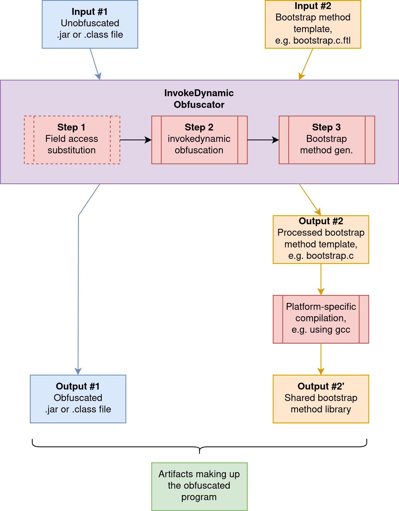

```{r include=FALSE}
knitr::opts_chunk$set(echo = FALSE, fig.align = "center");
```

# Introduction

Obfuscation techniques are an important tool to make malicious reverse engineering attempts of software harder
and more time-consuming. These techniques are often employed to protect trade secrets, intellectual property,
and program integrity.

Even higher importance is placed on the usage of obfuscation techniques when the software is deployed in an environment
controlled by a trusted user of the software (e.g. to a personal computer as opposed to a microcontroller for example)
for the prevention of so-called man-at-the-end (MATE) attacks as coined by [@falcarin11].

Programming languages compiled to high-level bytecode---such as Java Virtual Machine (JVM) bytecode instead of machine
code---are especially vulnerable to MATE attacks, as JVM bytecode is more structured and thus allows easier modification
when compared to machine code.

A variety of obfuscation techniques exist, some of which, such as symbol scrambling [@chan04], remove information in an
irreversible way.
Other aspects, like the interprocedural control flow graph of a program, are harder to obfuscate. Keeping this
information intact allows an attacker to gain great insight into the architecture and inner workings of an application.

Java 7 saw the introduction of the `invokedynamic` instruction which allows the invocation of methods without directly
specifying the target call site inside the bytecode, instead delegating execution to a so-called bootstrap method in
order to determine the call site at runtime rather than compile-time.
The instruction enables dynamic dispatch behavior similar to reflection but in a more performant way because the call
site can be accessed directly after its initial extraction from the bootstrap method as illustrated by [@ivanov15].
These properties have proven useful for call graph obfuscation efforts.

A novel obfuscation technique proposed by [@wood21] utilizing `invokedynamic` implements the bootstrap method inside a
native library and replaces regular `invoke*` instructions with `invokedynamic` ones, hindering static analysis
attempts. Outsourcing the bootstrap method implementation to native code increases the level of obfuscation and enables
the application of further obfuscation methods going beyond techniques available for the JVM. It also prevents analysis
of the bootstrap method bytecode with the help of established tools in the JVM ecosystem.

The proposed bachelor's thesis would primarily focus on this obfuscation technique in an aim to create an implementation
of it since none is openly available at the moment. Once a basic implementation is finished, it will be extended further
and evaluated.

# Problem

While a proof-of-concept has been developed for the novel obfuscation technique proposed by [@wood21],
no implementation of it has been released which hinders further benchmarking attempts that are needed in order to judge
its performance impact in a larger context: what are the performance implications when applying this technique to an
input program, especially across a broader variety of JVM distributions and JIT compilers whose optimization behavior
regarding `invokedynamic` might differ?

In addition to the lack of an implementation, the developed technique does not yet fully exhaust its potential and can
be further extended beyond obfuscation of the call graph itself: field access instructions (`getfield`, `putfield`,
`getstatic`, and `putstatic`) may be included in the obfuscation effort by replacing them with invocations to synthetic
accessor methods which will partake in the subsequent main obfuscation step.  
How large is the difference in performance when this extension is introduced compared to the performance of the
obfuscation technique without it?

The need for an additional native library containing the bootstrap method implementation along with the generation of
new methods when considering the extension for field accesses will reflect in the total size of the artifacts produced
by the obfuscation process.  
This increase in application size may be more or less significant depending on the type of deployment: containerized
and/or user-facing software --- the latter being the main use case for obfuscation --- is preferably kept as small as
possible, so the impact of the obfuscation process on application size should be measured by comparing the size of the
original input to the size of the obfuscated application (considering both the exclusion and inclusion of field
accesses in the obfuscation process). To what extend does the obfuscation lead to an increase in application size?  
Some executable formats used by virtual machines, such as the DEX format of the Dalvik VM built into Android
[@multidex], are limited regarding the amount of methods an application may contain, so how many additional synthetic
accessors can one expect when including the obfuscating of field access instructions?

Another area that is only briefly explored by the original paper but which should also be evaluated is the effectiveness
of the technique. How can one bypass the obfuscation technique using dynamic analysis and what is the complexity of it?
To a lesser extent: how easy is it for an attacker to identify the used obfuscation technique and to understand what
kinds of transformations have been applied to the code?

Answers to all of the above research questions will be used to draw a conclusion regarding the quality of the proposed
obfuscation technique.

# Solution Approach

## Implementation

The primary goal of the bachelor's thesis will lay on the implementation of an open-source tool capable of performing
the proposed obfuscation on single classes as well as entire JAR files using the ASM bytecode engineering library.
[@bruneton11]

Figure \@ref(fig:process-diagram) gives an overview of the three-step obfuscation process. Two inputs will be required
by the obfuscation tool: a JAR or class file to be obfuscated and a template for the bootstrap method which is
populated using the symbol table built in step 2.

**Step 1** is optional and responsible for the inclusion of field access instructions in the obfuscation effort to
increase the provided level of indirection, serving as an extension to the technique proposed by [@wood21].
Obfuscation of field accesses is achieved through the generation of synthetic getter and setter methods which are
invoked in place of the original instruction.
No further steps are necessary when performing this bytecode transformation as the first step before the main
obfuscation pass, as the generated `invoke*` instructions will be treated like any other method invocation present in
the original bytecode and replaced by an equivalent `invokedynamic` instruction.
Introducing the additional synthetic methods will lead to an inflation in bytecode size which should be measured by
comparing the size of the input file with that of the obfuscated output file.

Following the optional pre-processing of field instructions in the first step, obfuscation **step 2** is responsible
for the replacement of `invoke*` instructions with `invokedynamic` ones, making up the largest amount of bytecode
transformation operations.
A unique name is assigned to each encountered method invocation instruction and the association is stored in the symbol
table. The unique name is present in the bytecode of the `invokedynamic` instruction and is used by the bootstrap
method implementation to return the correct `CallSite` that was associated with it in the original bytecode.
The symbol table built from this obfuscation step is passed to the input bootstrap method template using a template
engine for the generation of the bootstrap method source code. Automatic compilation of the processed template is
outside the scope of the tool due to reasons outlined in section \ref{objectives-and-limitations}.

**Step 3** is the last obfuscation step and adds the bootstrap method definition to the main application class,
along with code responsible for loading the native library containing the bootstrap method implementation. The library
loading code is prepended to `<clinit>` to ensure that it is invoked before any other application code which might be
obfuscated (and thus assumes the bootstrap method implementation is already available).

(ref:process-diagram-cap) High-level overview of the obfuscation process.

```{r process-diagram, fig.cap="(ref:process-diagram-cap)"}

```

## Evaluation

Open research questions regarding the performance implications of the obfuscation technique on input JAR files will be
approached through the use of macrobenchmarks, either by using an established benchmark suite such as DaCapo [@dacapo06]
or by obfuscating an increasing amount of well-covered methods from the test suite of a set of open-source libraries as
done by [@pizzolotto18].  
Care must be taken when selecting the input JAR files to use for the benchmark, as they and their dependencies must be
compiled for newer Java versions. Reasons for this are outlined in section \ref{objectives-and-limitations}.
While no concrete libraries of applications have been chosen for their usage in benchmarks yet, reusing ones picked for
benchmarking purposes by other obfuscation techniques might allow some level of comparability.

The ease of identification will be judged by comparing the original bytecode with its obfuscated version. To determine
the complexity of an attack on the technique, an attempt at bypassing it will be made using dynamic analysis.
As all applications obfuscated using `invokedynamic`-based techniques will have to eventually instantiate one of the
three implementation of the `CallSite` interface to return it from the bootstrap method, it seems natural to focus on
this area in search for a way to record the call sites which are accessed, potentially circumventing the concept of the
native bootstrap method.

\newpage
# Related Work

An attempt at hiding the interprocedural control flow graph of JVM applications has been made by [@pizzolotto18] through
the translation of selected portions of program bytecode into native libraries but introduced a performance penalty
between 5% and 21% by doing so, as the method relies heavily on reflective calls which introduce a certain overhead.

[@fukuda14] proposes an obfuscation technique intended to confuse debugging tools through the addition or removal of
arguments from `MethodHandle` instances within the bootstrap method.

Various implementations of obfuscation techniques making use of the substitution of `invoke*` instructions with
`invokedynamic` exist, both open-source [@obfuscator] and commercial [@klassmaster], but none of them implement the
bootstrap method in native code.
No associated research papers seem to exist for either of the two projects.

# Objectives and Limitations

<!--
  Update to the Java 6 class file specification mentioning the chnages to verification of class files starting with
  bytecode version 50.

  - https://jcp.org/aboutJava/communityprocess/maintenance/jsr924/index2.html
  - https://jcp.org/en/jsr/detail?id=202
-->
For simplicity reasons, the obfuscation tool will likely be limited to support JVM bytecode emitted by newer versions
of Java compilers (class file major version $\geq$ 50), as bytecode targeting older versions of the class file format
does not necessarily contain stack map frames.
<!--
  Required class file version for invokedynamic instructions was tested manually with Krakatau using
  attack/InvokeDynamic.j by invoking "java -classpath . InvokeDynamic".
-->
While these class files can still be correctly loaded and verified by JVMs, the missing stack map frames pose an issue
when `invokedynamic` instructions are introduced, as that requires raising the bytecode major version to 51 or higher,
making stack map frames mandatory. ASM is capable of computing the stack map frames but requires loading the
classes using `Class.forName` in certain situations, which in turn would require loading the input JAR or class file
and any potential dependencies using a custom class loader, complicating the implementation.

A different area that is out of scope for the obfuscation tool is covering the entire functionality of the toolchain
required for the compilation of the native library containing a bootstrap method implementation. This includes the
invocation of a compiler from within the tool. Instead, the tool should provide templating capabilities to allow for
the production of valid source files in a user-chosen language by combining a template file with information obtained
in the obfuscation pass.
The last necessary compilation step would be left to the user of the obfuscation tool.

\newpage
# Preliminary Outline

\setlist[enumerate]{label*=\arabic*.}

\begin{enumerate}
    \item Introduction
    \item Background
    \begin{enumerate}
        \item Obfuscation Techniques
        \item Java Native Interface
        \item InvokeDynamic
        \item Proposed Technique
    \end{enumerate}
    \item Implementation
    \begin{enumerate}
        \item Extension
    \end{enumerate}
    \item Evaluation
    \begin{enumerate}
        \item Performance Overhead
        \item Bytecode Size Inflation
        \item Obfuscation Level
        \begin{enumerate}
            \item Ease of Recognition
            \item Attack Resilience
        \end{enumerate}
    \end{enumerate}
    \item Related Work
    \item Conclusion
\end{enumerate}

\newpage
# Schedule and Risk Analysis

```{r out.width="140%", out.extra="angle=90"}

```

\newpage
# References {.unnumbered}

<div id="refs"></div>

\vspace{6cm}

\begin{center}
     \begin{tabular}{l p{0.1\textwidth} r}
       \cline{1-1} \cline{3-3}
       \begin{minipage}[t]{0.4\textwidth}
         \centering
         Supervisor\\(Title First name Last name)
         \end{minipage}
&
         \begin{minipage}[t]{0.2\textwidth}
         \end{minipage}
&
         \begin{minipage}[t]{0.4\textwidth}
           \centering
           Student\\(First name Last name)
         \end{minipage}
     \end{tabular}
\end{center}
